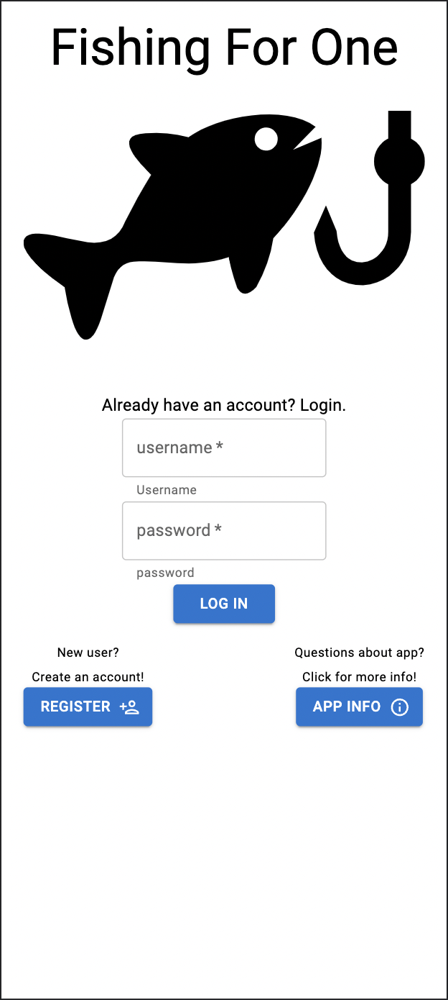
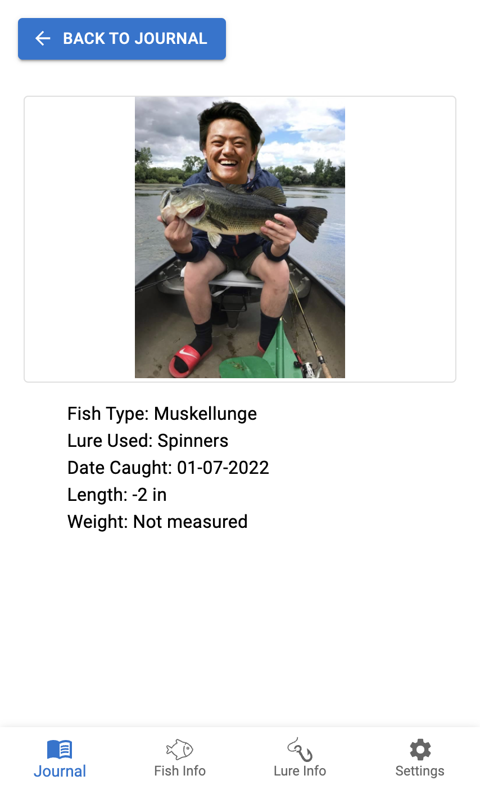
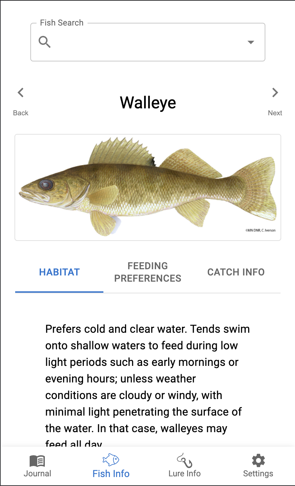
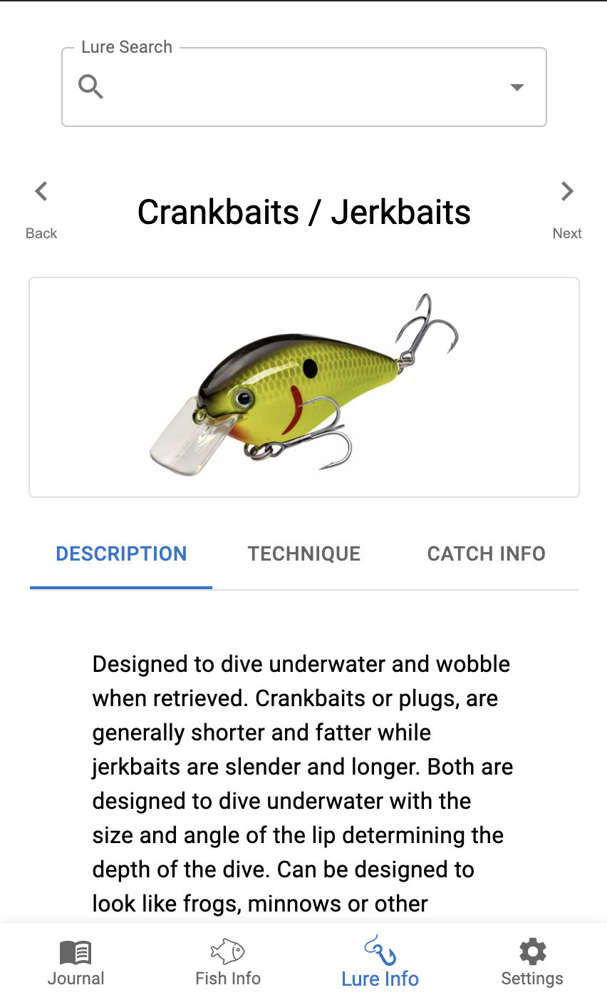
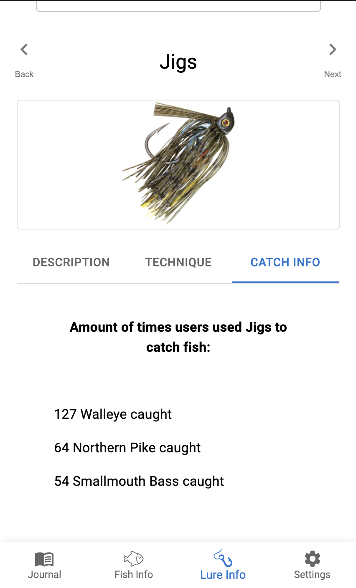
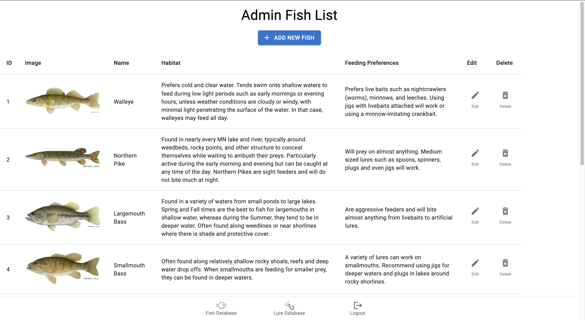
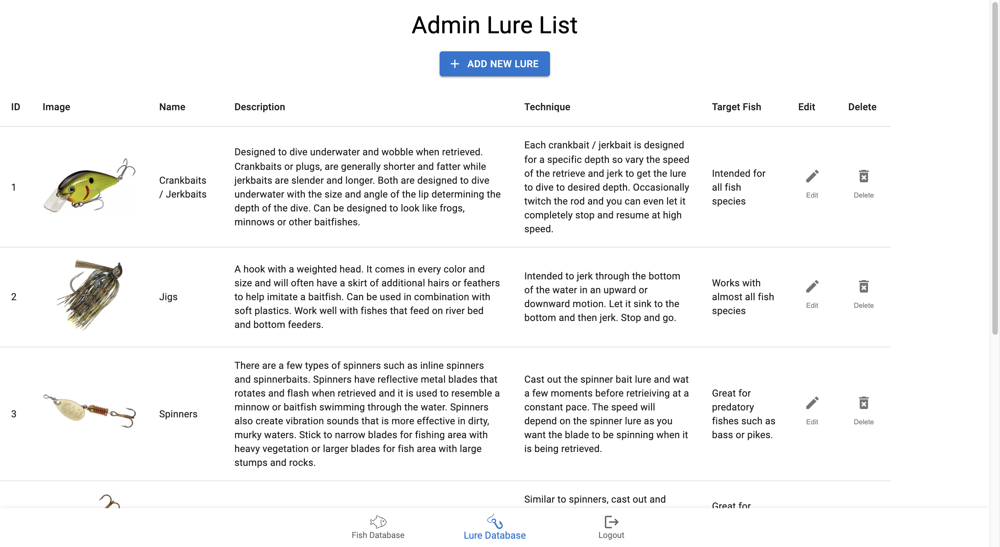

    
    
# Fishing For One

## Table of Contents

- [Fishing For One](#fishing-for-one)
  - [Table of Contents](#table-of-contents)
  - [Description](#description)
  - [Screenshots](#screenshots)
  - [Built With](#built-with)
  - [Getting Started](#getting-started)
    - [Prerequisites](#prerequisites)
    - [Installation](#installation)
  - [Usage](#usage)
  - [License](#license)
  - [Acknowledgements](#acknowledgements)
  - [Contacts](#contacts)

## Description

This application is designed to help the fishing experience for beginners. This app will provide detailed information about the local fishes and their feeding habits. This app will provide detailed information on the common types of lures and the circumstances of their usage. Along with detailed information on the local fishes, there will also be detailed information about common lures used in fishing. In the information, it will describe the usage of these lures and which types of fish they are commonly used for. There will also be user ratings on each lure to indicate to the user the catch-ability of the lure and how many fishes were caught by other app users. When the user has finally caught a fish, there is a fish journal where the user can upload information specifying the type of fish and type of lure used on their recent catch. This will be displayed in their journal along with past catches. 

[FishingForOne](https://fishingforone.herokuapp.com/)

## Screenshots

## Built With

## Getting Started

In order to observe and use the functionalities of this application, the user will be required to sign up for a few third-party API keys. The required third-party APIs offers both free and paid services. The required API keys are as followed:

- [Filestack API](https://www.filestack.com/)
- [Google Maps Embed API](https://developers.google.com/maps)

### Prerequisites

Softwares used in creating this application includes:

- [Visual Studio Code](https://code.visualstudio.com/)
- [PostgreSQL](https://www.postgresql.org/)
- [Postico](https://eggerapps.at/postico/)
- [Node.js](https://nodejs.org/en/)
- [Nodemon](https://nodemon.io/)

The application's repository may require alterations to lines of codes if used with other softwares that are not listed above.

### Installation

1. To run this application, the user should fork the repository onto their own GitHub account. In the user's repository, the user should copy the link and clone the repository onto their local system. Navigate to the repository folder using the terminal and run command line `npm install`
   - `$ cd ../fishing_for_one`
   - `$ npm install`
 

2. Create a .env file in the repository folder and insert in the following lines with the placeholder variables.
   SERVER_SESSION_SECRET="`strongPassword`"  
REACT_APP_FILESTACK_API_KEY="`filestackKey`"  
REACT_APP_GOOGLE_MAPS_API_KEY="`googleMapsKey`"  

   Replace `strongPassword` with a strong password of the user's choice or use [https://passwordsgenerator.net/](https://passwordsgenerator.net/) to generate a password to replace it with.
 

3. Create an GoogleMaps API account and obtain the API key. In the .env file, replace `googleMapsKey` with the API key given upon registration.
 

4. Create an Filestack API account and obtain the API key. In the .env file, replace `filestackKey` with the API key given upon registration.

   Now make sure all lines of the .env file have meaningful keys and no longer have the placeholder variables. If there are still placeholder variables, be sure to replace with corresponding keys.
 

5.  Create a local postgreSQL database called `fishing_for_one` with Postico using the command lines from the database.sql file. Using different database systems may require the user to alter or add additional command lines to reflect the example database provided.
 

6. To start up the application, enter in the terminal the npm command lines of:

   - `npm run server`
   - `npm run client`

   The server should be running on `http://localhost:5000` whereas the client should be on `http://localhost:3000`. Both the server and the client is required to be up and running for the application to run successfully.

## Usage

Once the application is up and running, the user should be redirected to the browser with the application loaded. If not, open up a browser and enter in the url:

- `http://localhost:3000`

This app currently have two types of users, an administrator and normal users. Both users will be required to create an account and be logged in to use the features of this app, however the users with admin-level access will include different features. 

The main features of this app for a normal user includes journal creations, viewing fish information and viewing lure information.

- Journals
     - The user can create a journal with catch informations by clicking the 'Add' button on the Journal page. This will redirect the user to a form where the user can enter in information about their caught fish.
     - Upon creating a journal entry, the user will be redirected back to the journal view where the page will be populated with the user's previous journal entries as gallery items.
     - The user can then click on these image gallery to be redirected details page about the selected entry. 
- Fish Information
     - The user can view information about a certain type of fish on this view page. The type of fish can be selected via the dropdown menu or by clicking the navigation buttons on the left and right side of the images. There consists of three types of information for each fish type.
     - Viewing the 'Habitat' tab, will display information about the selected fish's common habitat.
     - Viewing the 'Feeding Preferences'  tab will display information about common feeding preferences about the selected fish.
     - Viewing the 'Catch Info' tab will display the top 3 types of lures used to catch the selected fish type. These information are populated using data provided by users using the app.
- Lure Information
     - The user can view information about a certain type of lure on this view page. The type of lure can be selected via the dropdown menu or by clicking the navigation buttons on the left and right side of the images. There consists of three types of information for each lure type.
     - Viewing the 'Description' tab will display information about the common appearances and features of the lure type.
     - Viewing the 'Technique' tab will display information on how to use the selected lure when fishing.
     - Viewing the 'Catch Info' tab will display the top 3 types of fishes caught using the selected lure. These information are populated using data provided by users using the app.

The main features of users with admin-level access include data management, such as adding, editing, or deleting information on fish types and lure types.

## License

<a href="https://choosealicense.com/licenses/unlicense/">The Unlicense</a>

## Acknowledgements

I would like to extend a thanks to our instructors, Dane Smith and Liz Kerber, the Solinas Cohort, and the whole greater community at Prime Digital Academy, for providing me with the necessary tools and skills to succeed.

Lastly, I would like to thank our friends and families for continuing to support me as I've continued to grow into becoming a software developer.

## Contacts

Chaoching Vang
  